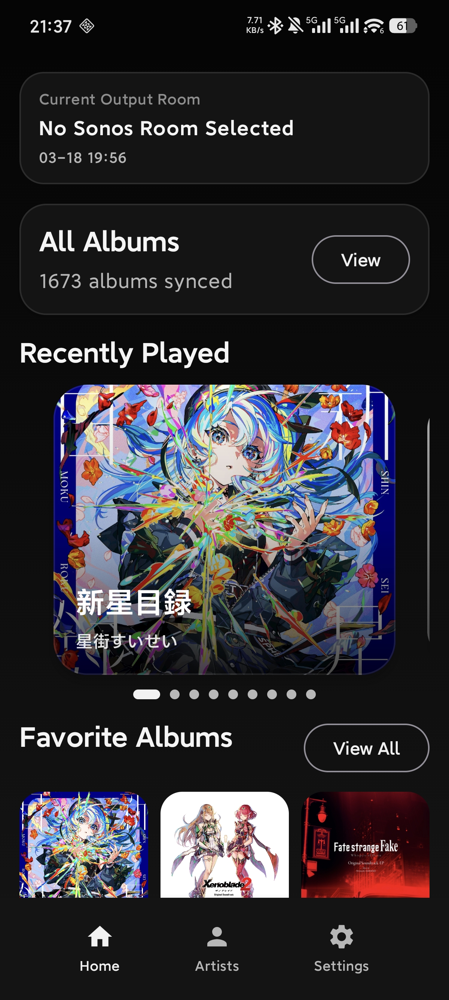
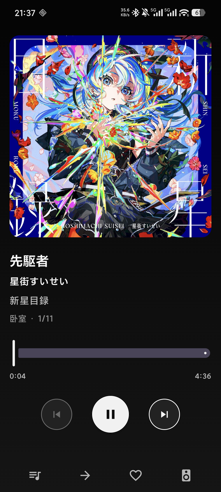
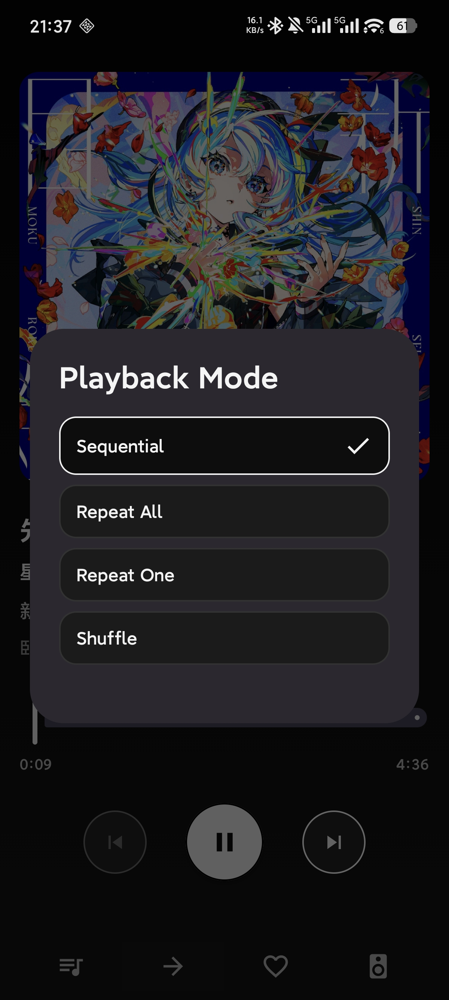
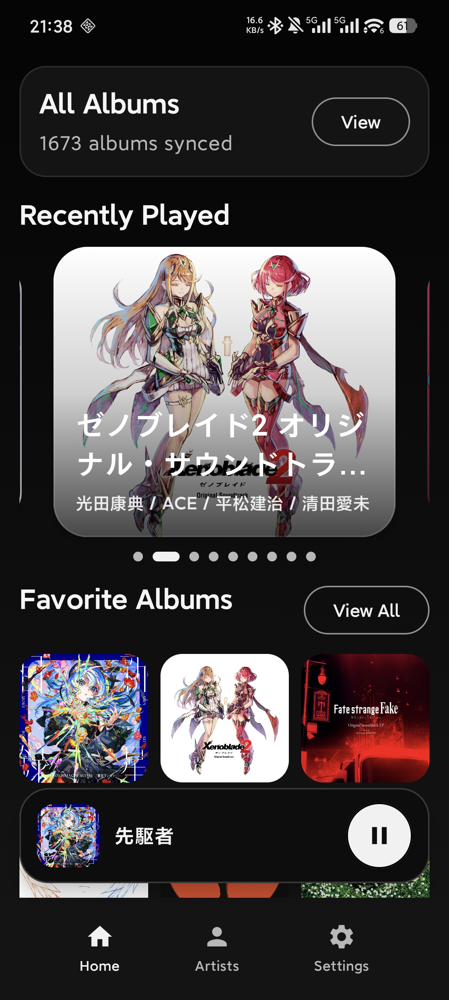
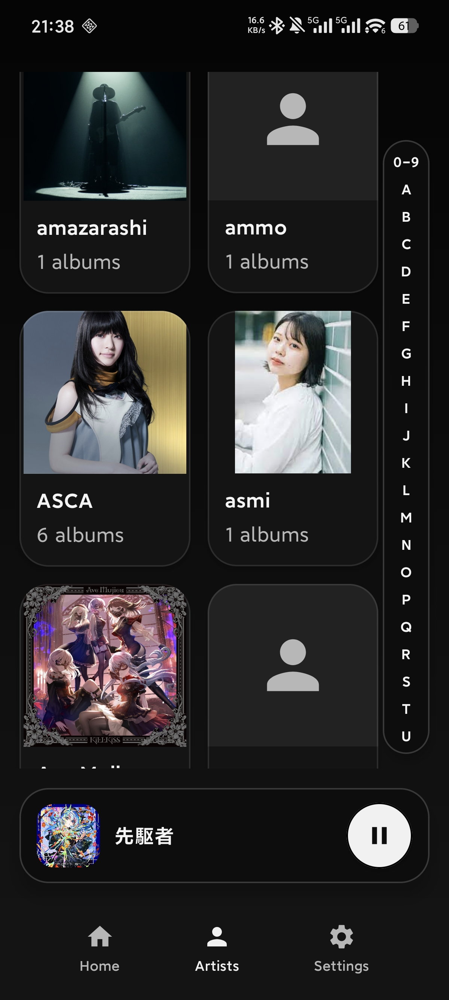

# MusicBridge

<p align="center">
  
</p>

中文 | [English](./README.md)

一个将 Plex 媒体库桥接到 Sonos 音箱的 Android 应用。

## 下载

从 [Releases](https://github.com/lux032/MusicBridge/releases) 下载最新的 APK

## 功能特性

- 浏览 Plex 音乐库（专辑、艺术家、歌单）
- 发现并控制网络中的 Sonos 音箱
- 从 Plex 串流音乐到 Sonos
- 实时播放控制和状态显示
- Material Design 3 界面

## 系统要求

- Android 7.0 (API 24) 或更高版本
- Plex Media Server
- 同一网络下的 Sonos 音箱

## 安装

1. 克隆仓库
```bash
git clone https://github.com/lux032/MusicBridge.git
```
2. 使用 Android Studio 打开项目
3. 构建并在设备上运行

## 配置

首次启动时：
1. 输入 Plex 服务器地址（例如：`http://192.168.1.100:32400`）
2. 输入 Plex 认证令牌
3. 应用会自动发现网络中的 Sonos 音箱
4. 选择音箱并开始播放音乐

## 应用截图

<p align="center">
  
  
  
  
  
</p>

## 许可证

MIT
